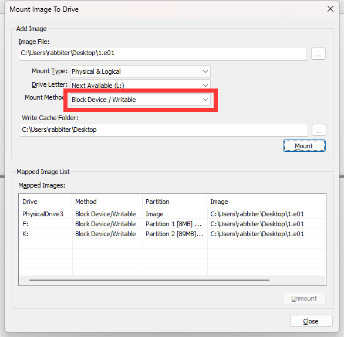
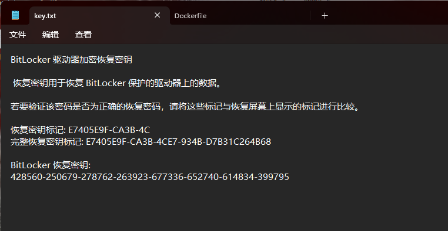
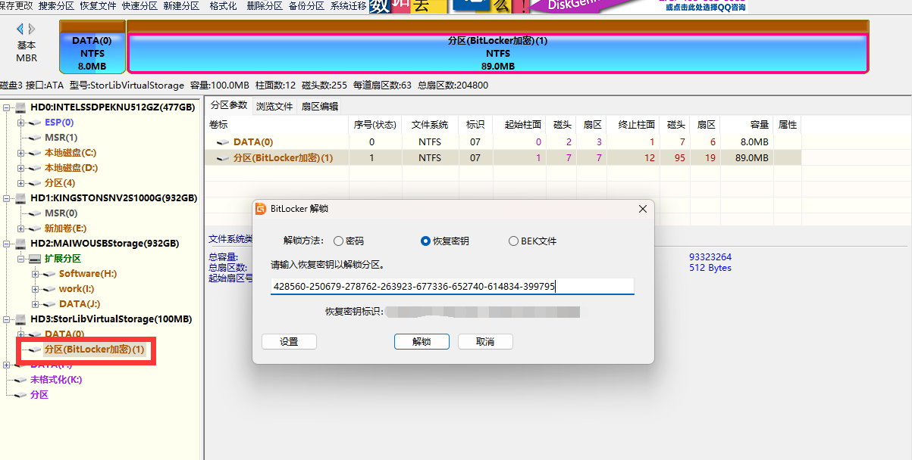
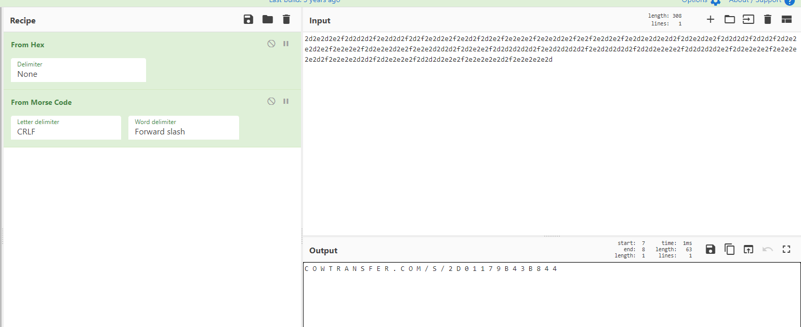
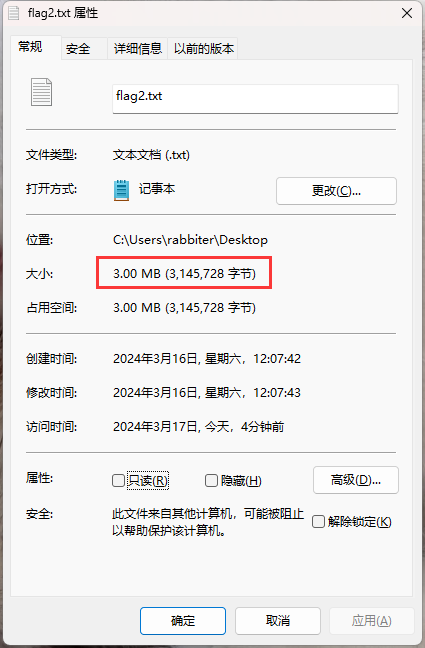
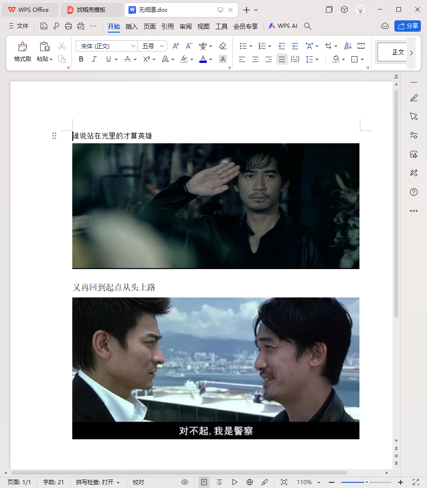
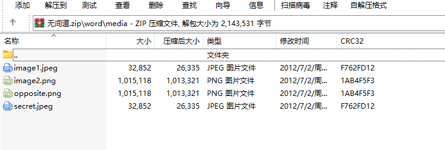
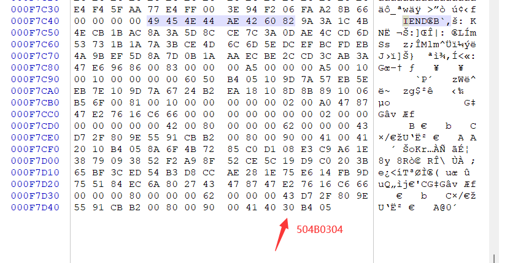
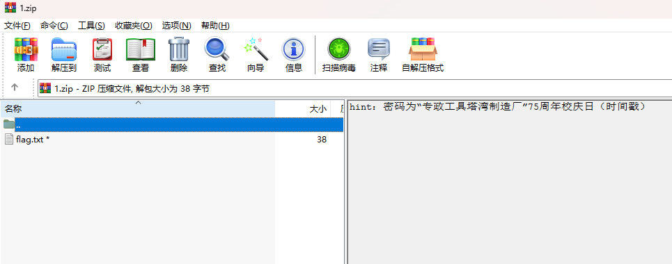
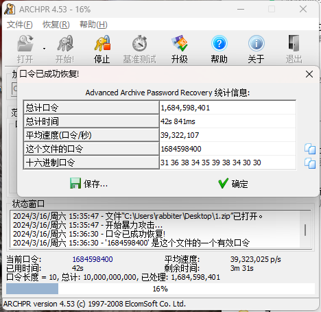

# VCTF -f0rensicmaster

题目给了一个.e01文件，，直接上FTK挂载，记得这里选可写



两个盘，一个是BitLocker加密的，一个可以直接打开，里面一个图片一个压缩包，图片的名字和压缩包里面的一样，那就直接明文爆破，7z加密，获得压缩包内文件key.txt



然后拿恢复密钥去解锁另一个磁盘，这里我是使用DiskGenius直接解锁的，需要注意的是需要用高版本的才有这个功能，我用的是5.5.1的，官网下载个社区版就可以，直接右键就有解锁选项



然后浏览文件拿到flag.txt

```
2d2e2d2e2f2d2d2d2f2e2d2d2f2d2f2e2d2e2f2e2d2f2d2e2f2e2e2e2f2e2e2d2e2f2e2f2e2d2e2f2e2d2e2d2e2d2f2d2e2d2e2f2d2d2d2f2d2d2f2d2e2e2d2e2f2e2e2e2f2d2e2e2d2e2f2e2e2d2d2d2f2d2e2e2f2d2d2d2d2d2f2e2d2d2d2d2f2e2d2d2d2d2f2d2d2e2e2e2f2d2d2d2d2e2f2d2e2e2e2f2e2e2e2e2d2f2e2e2e2d2d2f2d2e2e2e2f2d2d2d2e2e2f2e2e2e2e2d2f2e2e2e2e2d
```

丢到CyberChef里面解密得到`COWTRANSFER.COM/S/2D01179B43B844`



然后访问这个网址下载到另一个flag文件（当时做到这里我都以为要搞完了，谁知道给我整了个活来了个网盘链接）



新下载到的文件是一个3.00M整的文件，并且用winhex打开看没有特定的文件头，所以这里考虑用VeraCrypt挂载一下，密码为   `RtTNZ&n\*\$GKaKuehKO3+`没找到在哪里，看提示给的

解密后得到一个word文档 里面两个图片  

这里可以把这个文档的后缀改成zip，然后压缩包打开，在\word\media路径下看到这两个图片的原本的名字

拖出来保存，这里的opposite的意思是相反的，通过winhex观察可以发现，在png文件尾`49454E44 AE426082`后面还有另外的一些数据，结合文件名发现后面的这些数据是一个反转过来的zip文件

将这部分数据反转后另存为zip文件 ，得到最后一个压缩包



还有密码。。。。。 这个提示，也没和出题人的脑洞保持一致，我搜索的结果是，专政工具是指警察，所以我以为是一个在塔湾的警察类学校的75周年校庆日，搜索得到的是`中国刑事警察学院`，但是结果不对，气死了，想不通的直接开爆！



长度十位范围0-9开跑！

最后跑出来结果是`1684598400`，不知道是哪个学校的校庆，总之flag出来了
