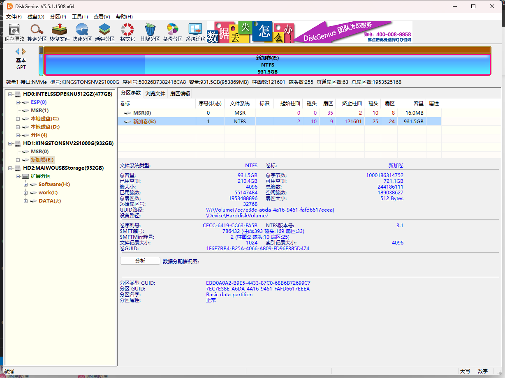
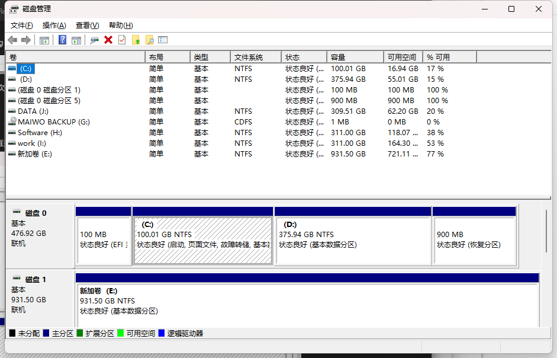
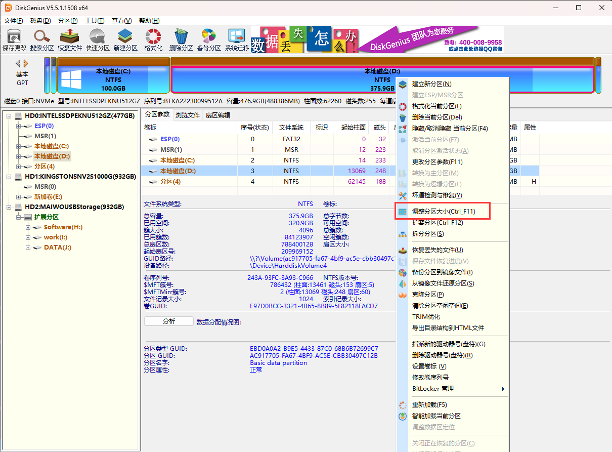
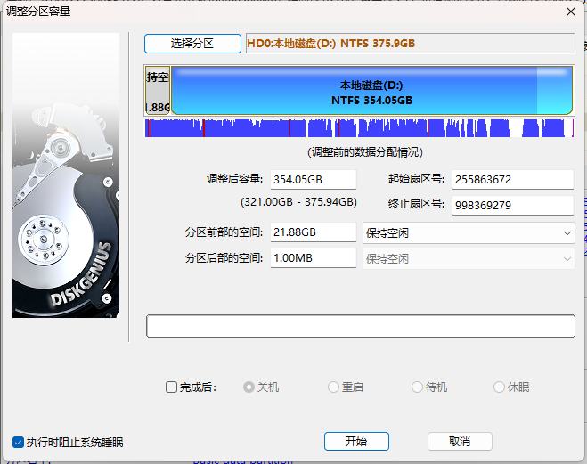
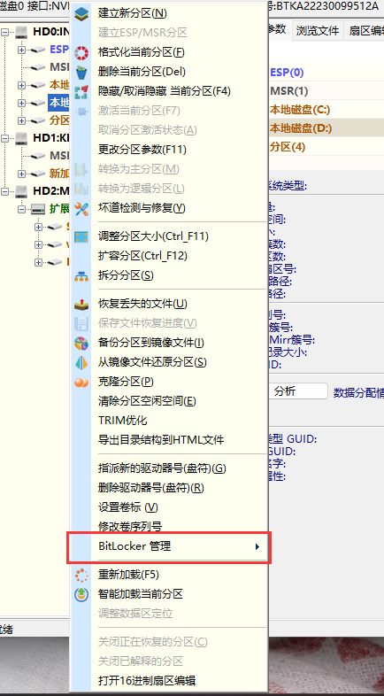

# DiskGenius-磁盘分区&数据恢复

## [官网](https://www.diskgenius.cn/)

*DiskGenius*是一款硬盘分区及数据恢复软件。

### 磁盘分区功能

windows本身是自带磁盘分区功能的，直接在设置里面搜磁盘管理就可以打开

可以讲插入的磁盘根据需要进行分区，但是这个功能有一个局限性，就是仅支持将压缩出来的空闲区域放在盘的右边，这举个例子，比如这个磁盘D，目前还有可用空间55G，如果我想把这部分空闲区域分给C盘的话是做不到的，因为压缩卷后空闲区与只会出现在D分区的后半部分，无法和C分区合并

这时候就需要使用到diskgenius来操作

直接右键调整分区大小，可以通过拖动分区左边的区域来将空白区域调整到该分区前半部分，然后再将前部空间和C盘合并，最终实现扩容C盘的效果

### 解锁BitLocker

直接右键可以通过密钥来解锁被BitLocker加密的磁盘

