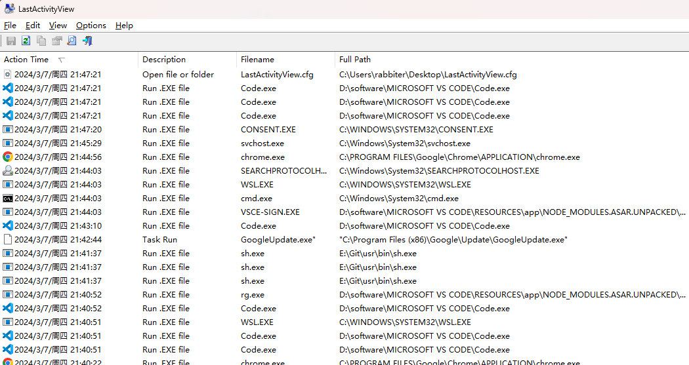

# LastActivityView-系统日志分析

## [官网](https://www.nirsoft.net/utils/computer_activity_view.html)

通过流量分析设备发现内网终端有可疑行为后，上机排查时可以使用该工具对异常行为时间段内的系统日志进行分析，本质上是把系统日志可视化了，更加清楚，所以这个软件不需要常驻后台，随时开启随时读系统日志展示出来，可以看到的有登录日志、软件运行日志、文件/文件夹打开日志、系统定时任务日志 等，我个人一般用它来排查红队入侵
