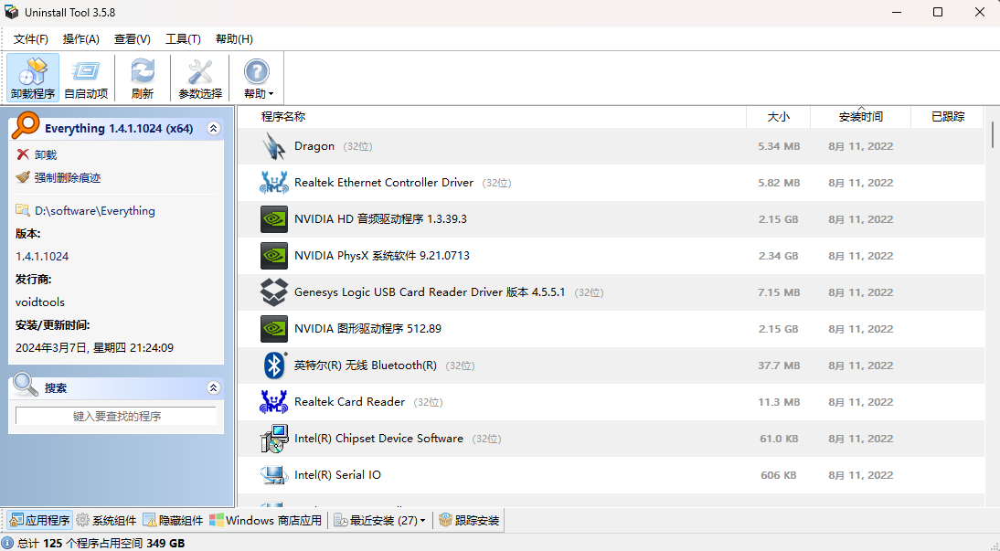
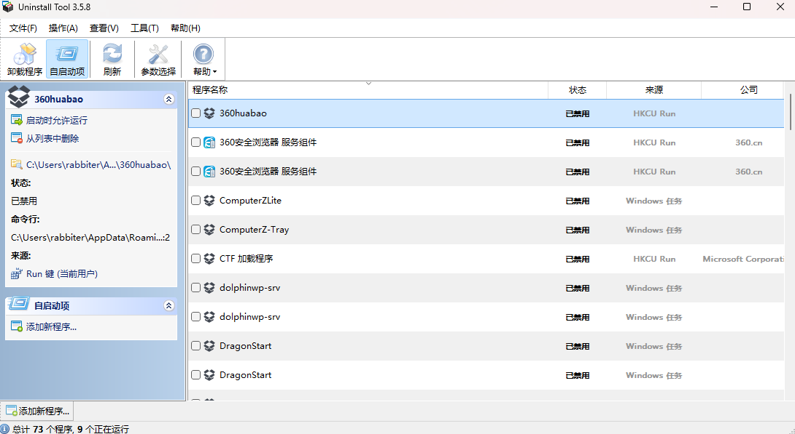

# Uninstall Tool-卸载清理器

## [官网](https://crystalidea.com/uninstall-tool)

其实就是把设置里面的那个程序搬出来了，能够很直观的看到目前电脑上安装的程序的各项信息，直接双击就可以卸载，运行完卸载程序以后会扫描残留文件和注册表进行深度清理（需要注意的是如果安装软件的时候直接安装在了根目录的话会清理大量文件，所以卸载前要看下要清理的文件夹），另外还可以直接通过该文件来查看系统的开机启动项，优化开机速度
