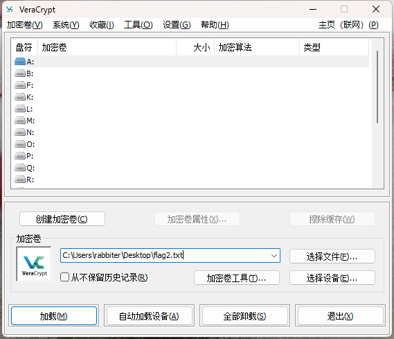

# VeraCrypt-数据加密软件

## [官网](https://veracrypt.fr/en/Home.html)    [github](https://github.com/veracrypt/VeraCrypt)

VeraCrypt是一个开源的磁盘加密软件，可以创建虚拟加密磁盘、加密整个分区或者系统盘。以下是使用VeraCrypt的基本步骤

1. 下载并安装VeraCrypt。
2. 打开VeraCrypt，在主界面中选择“Create an encrypted volume”（创建加密卷）或“Encrypt a non-system partition/drive”（加密非系统分区/驱动器）。
3. 选择加密算法和密钥大小，一般建议选择AES（高级加密标准）和256位密钥。
4. 选择加密模式，包括隐藏加密卷、加密整个分区或系统盘等。
5. 选择要加密的磁盘或分区，设置加密卷的大小和位置。
6. 输入密码和其他选项，如文件系统类型、挂载点等。
7. 点击“Create”（创建）或“Encrypt”（加密）按钮开始加密过程。
8. 等待加密完成，然后按照提示进行操作，如格式化加密卷、挂载加密卷等。

在CTF杂项分类中可能会遇到，特征是当题目给的文件**后缀为vera** 或者**文件大小刚好为整数**时考虑用VeraCrypt来进行挂载****

密钥可以为文件，也可以为字符串
