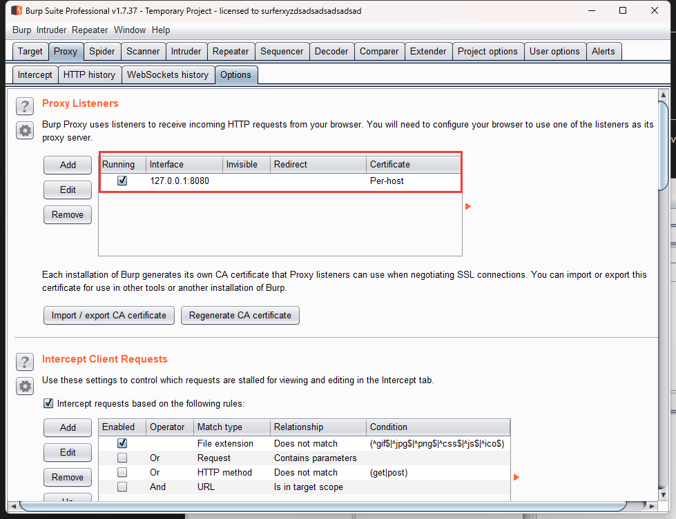
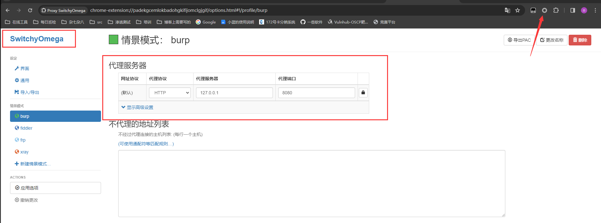
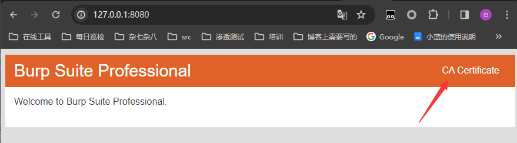
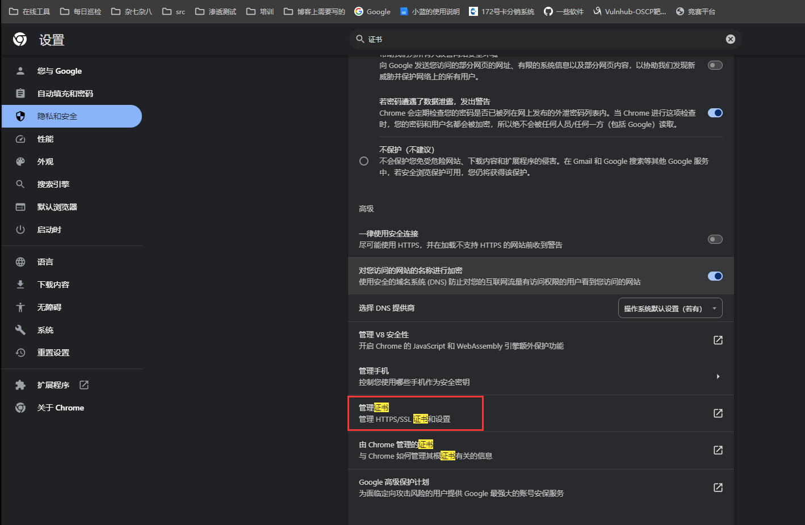
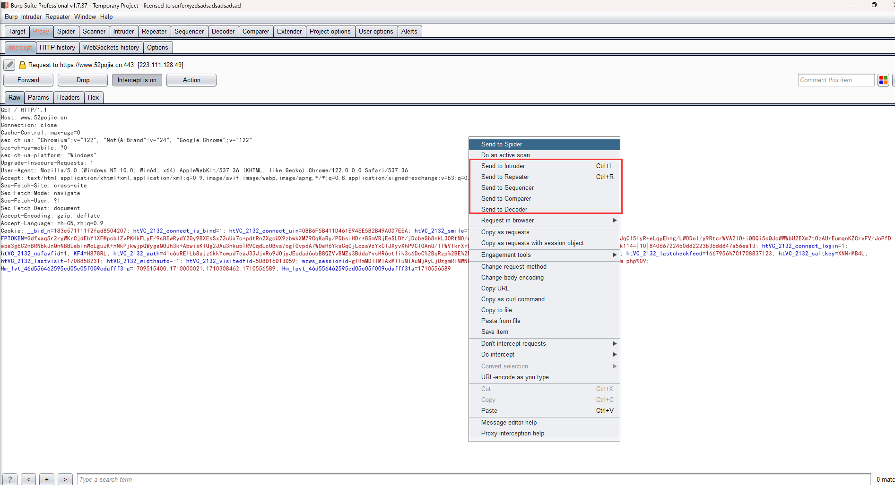
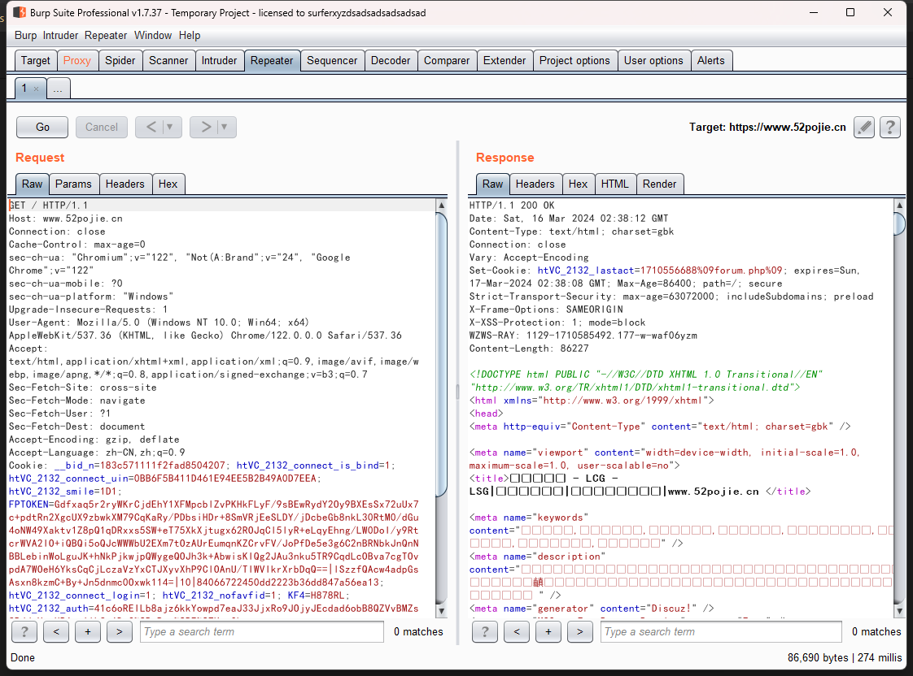
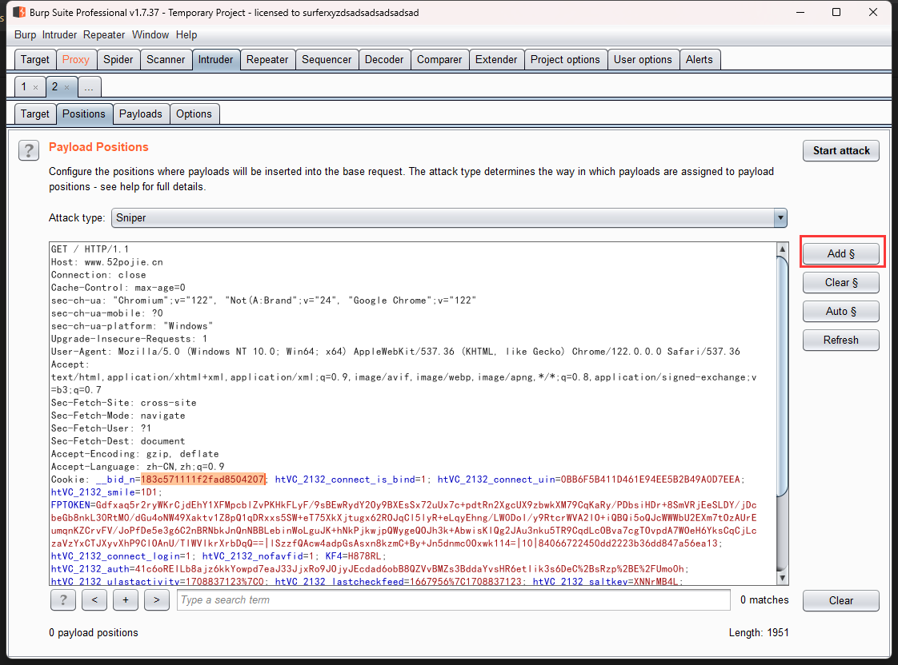

# Burp suite-抓包工具

Burpsuite

## 工具配置

burp需要java环境，我这里演示用的是1.7版本的，java用1.8的就可以了，如果是使用的新版本的话根据需求安装java15以上的，自行安装

开始抓包前有些配置需要修改下

1. burp默认是监听的8080端口，需要在浏览器上配置一下，我这边是使用的谷歌浏览器的SwitchyOmega插件实现的
2. 打开burp后直接访问http://127.0.0.1:8080/就可以下载到burp的证书
   这个证书需要导入到浏览器的证书内
3. 这两步配置完了以后就可以成功抓包了

## 抓包

打开burp，修改浏览器代理端口，打开Intercept，开抓！

在这个页面可以对数据包进行修改，然后再发送出去，也可以发送到其他模块来进行二次操作，

## 重放  Repeater

该模块的作用是可以对一个数据包进行多次重放并直接观察到回包，一般用于存在命令执行的漏洞点进行测试

## 爆破  Intruder

在对登陆页面进行渗透测试时经常使用，对想要爆破的参数添加$$符号框起来，然后再Payloads中选择想要爆破的字典即可，burp内置很多种爆破规则， 可以去CSDN找几个博客看看，这里不一一列举了

## 插件

burp是可以通过添加插件来直接实现漏洞扫描功能的，下列为常用插件推荐

Copy As Python-Requests

HackBar

chunken-coding-converter

HaE

jsEncrypter
