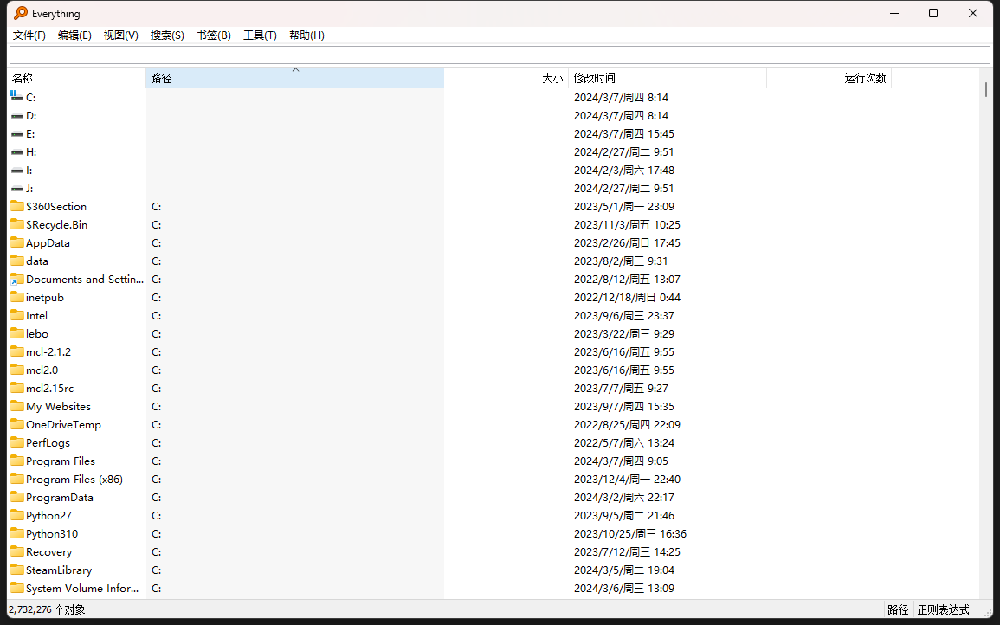

# everything-文件搜索

## [官网](https://www.voidtools.com/zh-cn/)

主要用途是快速检索磁盘中的文件

### 个人使用习惯

1. 使用· （就是键盘esc下面那个）键打开，空格打开选中并退出
2. 默认界面使用按运行次数排序，这样可以快速定位到常用的文件

### 进阶用法

应急响应时，可以通过everything快速定位某时间段内电脑上的文件修改痕迹

具体操作为

1. 通过系统日志分析或流量监测设备定位到终端的首次被攻击时间
2. 使用搜索语法搜索该时间段内终端的文件修改记录 如 dm:2024/1 可以查看2024年1月修改的文件

      注：该功能需要关闭正则搜索，具体语法可看[使用手册](https://www.voidtools.com/zh-cn/faq)

