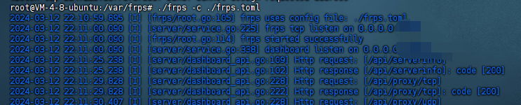
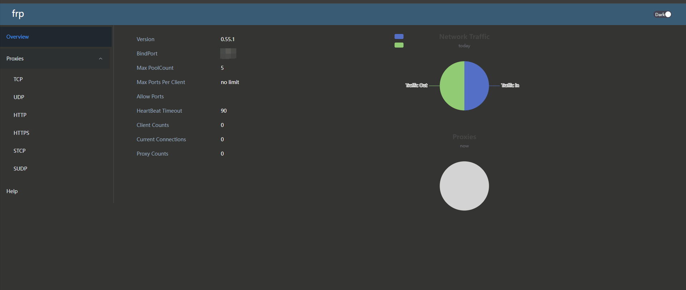
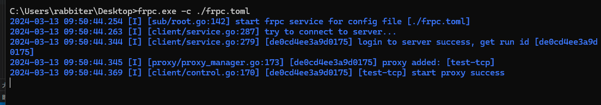
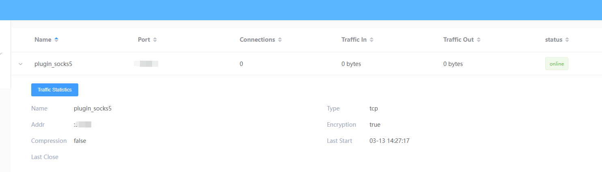
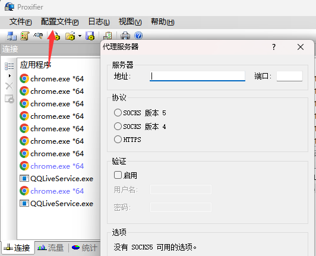
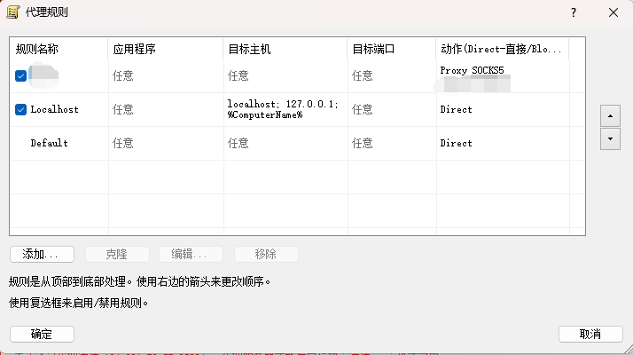

# frp -内网穿透工具

# [github](https://github.com/fatedier/frp)

**从0.52版本开始支持 TOML、YAML 和 JSON 进行配置。请注意，INI 已弃用，并将在未来版本中删除。**

## 0.52+ 版本配置文件

### 服务端配置

首先根据自己的cpu版本下载对应的安装包，可以参考[这篇文章](../../Environment/开源软件安装包选择)

frpc是客户端要运行的 frps是服务端要运行的

另外两个.toml文件时配置文件，要对应的一起用的，首先是服务端的配置文件

frps.toml

```md
bindPort = 7000 #{必选} 客户端与该端口建立连接  
log.to = "console" #{可选}  日志配置， 通过打印的方式输出日志  
vhostHTTPPort = 7100 #{可选} http代理需要，当访问该端口时跳到对应本地frpc代理
vhostHTTPSPort = 7200  #{可选} https代理需要，当访问该端口时跳到对应本地frpc代理 
transport.tcpMux = true #tcp流多路复用（优化传输，需一致）

#身份验证

auth.method = "token"  #{可选}身份验证方式 
auth.token = "password" #token设置密码，用于通过身份验证创建连接

#frp服务仪表板配置

webServer.port = 7300  #{也可自行修改端口}  
webServer.addr = "0.0.0.0" #公网ip或者域名  
webServer.user = "admin" #登录用户名{可自行修改}  
webServer.password = "admin" #登录密码{可自行修改}
```

配置好以后直接`./frps -c ./frps.toml`启动就可以了



然后可以访问你在frps.toml 中配置的仪表盘的端口就可以看到，然后输入配置文件中写入的账号密码即可登陆成功



### 客户端配置

客户端配置文件示例

```
serverAddr = "1.2.3.4"   #[必选]服务器ip地址/域名
serverPort = 7000        # [必选] 要连接的 frps 端口
transport.protocol = "kcp"  #传输协议选择（除tcp以外的协议要填）
auth.token = "password"   #与服务端校验的令牌（需一致）
transport.tcpMux = true   #tcp流多路复用（优化传输，需一致）

示例
[[proxies]]          
name = "web"                     # 代理名称(随便填)
type = "tcp"                     # 代理类型
localIP = "192.168.0.105"        # 代理地址, 要转发到哪个地址
localPort = 5500                 # 代理端口, 要转发到哪个端口
remotePort = 7001                # 远程端口(和远程 frps 哪个端口绑定在一起, 访问对应端口将使用该代理)

```

配置完成后，客户端执行`frpc.exe -c ./frpc.exe`即可



打开服务器的管理后台，可以看到已经有链接在线了

## 低版本ini文件配置

### 服务端配置

```md
[common]
bind_port = 7001 //服务器端口
token = "token"  //填验证token
dashboard_addr = 0.0.0.0 //管理面板地址
dashboard_port = 37500  //管理面板端口

dashboard_user = xxx //管理面板登录账号
dashboard_pwd = xxx  //管理面板登录密码

log_file = ./frps.log
log_level = info
log_max_days = 3
```

### 客户端配置

```md
[common]
server_addr = 0.0.0.0 //服务器公网IP地址
server_port = 7001    //服务器管理端口
token = "xxx"        //和服务器保持一致

[plugin_socks5]
type = tcp
remote_port = 7004  //这里填你想要代理的公网服务器的端口
plugin = socks5  
plugin_user = xxx
plugin_passwd = xxx
use_encryption = true

```

## 使用Proxifier链接

服务端和客户端都写好配置文件且运行起来后，即可使用Proxifier链接，在配置文件——添加代理服务器中填写公网IP及想要使用的代理的端口（在客户端配置文件写的那个端口），协议选择socks5 验证启用，填写用户名和密码



然后新建规则，添加应用程序为浏览器，目标端口为80/443，即可直接通过内网IP访问到目标机器内网的网站


