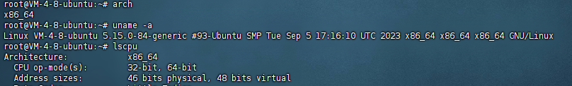

# amd64、x86、x86_64、arm64 的区别

安装github上的软件时总是会遇到存在多个安装包的情况，实际上这些不同的安装包是指你所使用的CPU的架构为什么版本记录下各个安装包之间的区别

常见的CPU架构有

**ARM架构：aarch64、arm64**

**X86架构：x86\_64、x64、AMD64**

**MIPS架构：mips**

linux系统可以使用`arch`  `uname -a` `lscpu`等命令来查看自己的CPU架构

